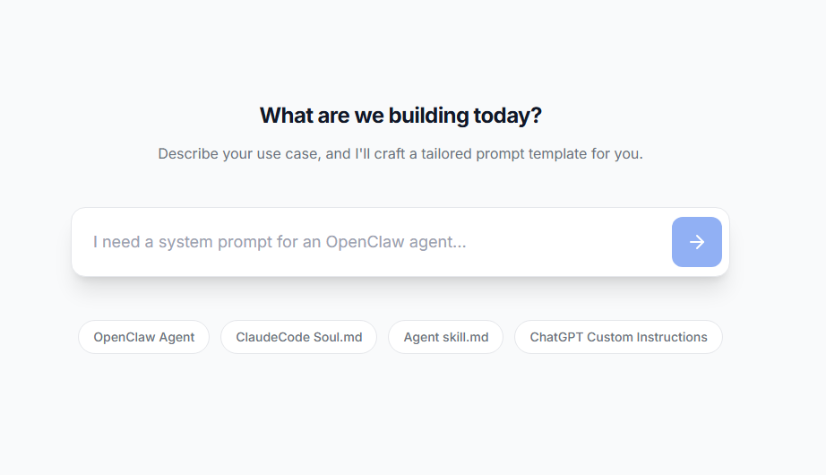

# Prompt Factory

A focused, visual prompt engineering workbench for crafting, refining, and managing LLM prompt templates.


## Features

- **AI-Guided Generation** — Describe your use case in plain language; Gemini drafts a structured template instantly
- **Prompt Editor** — Markdown-aware editor with word/character/token metrics to keep your contexts within budget.
- **Enhance Suite** — Proofread, shorten, or optimize any prompt via Gemini with a side-by-side, color-coded inline diff view.
- **History & Favorites** — Persistent prompt library with markdown preview cards, sorting, search filters, and single-click favorites.
- **Export & Forking** — Easily fork existing prompts to iterate on templates or copy clean text/markdown ready for API execution.

## Tech Stack

- **Frontend Framework:** React 19, TypeScript
- **Build Tool / Bundler:** Vite 6
- **Styling:** Tailwind CSS v4
- **LLM Integration:** Google Gemini API

## Getting Started

### Prerequisites

- Node.js ≥ 18
- npm ≥ 9

### Installation

1. **Clone the repository:**
   ```bash
   git clone https://github.com/your-username/prompt-factory.git
   cd prompt-factory
   ```

2. **Install dependencies:**
   ```bash
   npm install
   ```

3. **Configure Environment Variables:**
   Copy the example environment file:
   ```bash
   cp .env.example .env
   ```
   Open the `.env` file and insert your Google Gemini API key:
   ```env
   VITE_GEMINI_API_KEY=your_gemini_api_key_here
   ```

4. **Start the Development Server:**
   ```bash
   npm run dev
   ```
   The application will run locally at `http://localhost:3000`.

### Building for Production

To build static assets for production deployment:
```bash
npm run build
```
The output will be placed in the `dist/` directory.

## Project Structure

```
prompt-factory/
├── src/
│   ├── components/
│   │   ├── AIGuidedExplore.tsx   # Landing page — AI-driven prompt generation
│   │   ├── Editor.tsx            # Multi-mode prompt editor & diff enhancements
│   │   ├── Feed.tsx              # History/favorites browser & filters
│   │   ├── Sidebar.tsx           # Collapsible sidebar and application navigation
│   │   └── SpecCard.tsx          # Card view component for markdown rendering
│   ├── App.tsx                   # Central state management and route handler
│   ├── types.ts                  # Shared TypeScript models (Provider, Spec, etc.)
│   ├── index.css                 # Tailwind design tokens and custom styles
│   └── main.tsx                  # Vite application entry point
├── public/                       # Static public assets
├── package.json                  # Dependencies and scripts
└── tsconfig.json                 # TypeScript compiler configuration
```

## Environment Variables

| Variable | Description | Source |
|---|---|---|
| `VITE_GEMINI_API_KEY` | Google Gemini API Key |

## Contributing

Contributions are welcome! Please follow these guidelines:

1. Fork the Project.
2. Create your Feature Branch (`git checkout -b feature/AmazingFeature`).
3. Commit your Changes (`git commit -m 'Add some AmazingFeature'`).
4. Push to the Branch (`git push origin feature/AmazingFeature`).
5. Open a Pull Request.

## License

Distributed under the MIT License. See `LICENSE` for more information.

